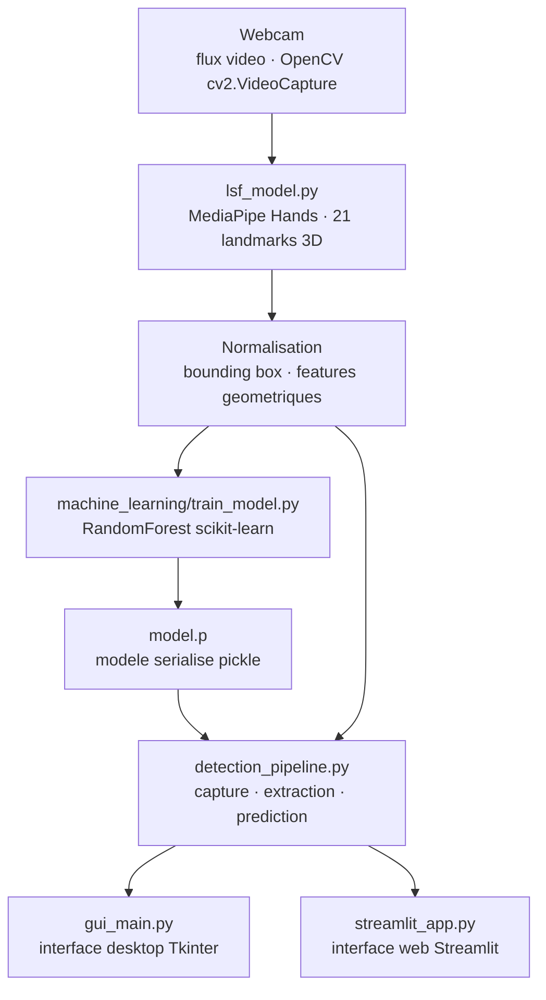

# Langue des Signes · Reconnaissance Multilingue par Computer Vision

<!-- adam-badges:start -->
[](https://github.com/Adam-Blf/Langue-des-signes/commits) [](https://hits.sh/github.com/Adam-Blf/Langue-des-signes/) [](https://github.com/Adam-Blf/Langue-des-signes/commits) [](https://github.com/Adam-Blf/Langue-des-signes) [](LICENSE)
<!-- adam-badges:end -->


[](https://www.efrei.fr/)


Reconnaissance en temps reel des alphabets de langues des signes via webcam. MediaPipe Hands pour l'extraction des 21 landmarks de la main, classificateur ML entraine sur les coordonnees normalisees. Sept langues supportees.

## Architecture



## Contexte

Projet personnel orientation Computer Vision et accessibilite. Demontre le pipeline complet · capture video temps reel, extraction de features geometriques, classification supervisee, interface Streamlit et desktop Tkinter.

## Langues supportees

Francais (LSF), Anglais (ASL), Espagnol, Italien, Portugais, Russe, Allemand, Turc.

## Methode

- **Capture** · flux webcam via OpenCV (`cv2.VideoCapture`)
- **Extraction** · MediaPipe Hands · 21 landmarks 3D par main detectee, normalisation par bounding box
- **Dataset** · collecte de frames par lettre (script `generate_synthetic_data.py` + collecte manuelle), stockage CSV
- **Modele** · RandomForestClassifier scikit-learn entraine sur les coordonnees normalisees (`train_model.py`)
- **Inference** · `detection_pipeline.py` orchestre capture, extraction, prediction
- **Interfaces** · app desktop Tkinter (`gui_main.py`) et app web Streamlit (`streamlit_app.py`)

## Stack

- **Langage** · Python 3.11
- **Vision** · OpenCV, MediaPipe (solutions.hands)
- **ML** · scikit-learn (RandomForestClassifier), pickle pour la serialisation
- **UI** · Tkinter (desktop), Streamlit (web)
- **Deploiement** · render.yaml configure pour Streamlit Cloud / Render

## Structure

```
Langue-des-signes/
├── lsf_model.py              # Wrapper MediaPipe Hands
├── detection_pipeline.py     # Pipeline capture, extraction, prediction
├── letters_conditions.py     # Regles geometriques par lettre
├── machine_learning/
│   ├── train_model.py        # Entrainement RandomForest
│   ├── generate_synthetic_data.py
│   ├── data.csv              # Dataset features + labels
│   ├── model.p               # Modele serialise
│   └── confusion_matrix.png  # Evaluation
├── app.py                    # Entrypoint principal
├── gui_main.py               # Interface Tkinter desktop
└── streamlit_app.py          # Interface web
```

## Resultats

- Detection robuste en temps reel (>= 20 FPS sur CPU standard)
- Matrice de confusion visualisee dans `machine_learning/confusion_matrix.png`
- Fonctionnement offline apres telechargement du modele MediaPipe

## Reproduction

```bash
git clone https://github.com/Adam-Blf/Langue-des-signes
cd Langue-des-signes
pip install -r requirements.txt

# Desktop (OpenCV window)
python app.py

# Web (Streamlit)
streamlit run streamlit_app.py
```

## Licence

MIT

---

<p align="center">
  <sub>Par <a href="https://adam.beloucif.com">Adam Beloucif</a> · Data Engineer & Fullstack Developer · <a href="https://github.com/Adam-Blf">GitHub</a> · <a href="https://www.linkedin.com/in/adambeloucif/">LinkedIn</a></sub>
</p>